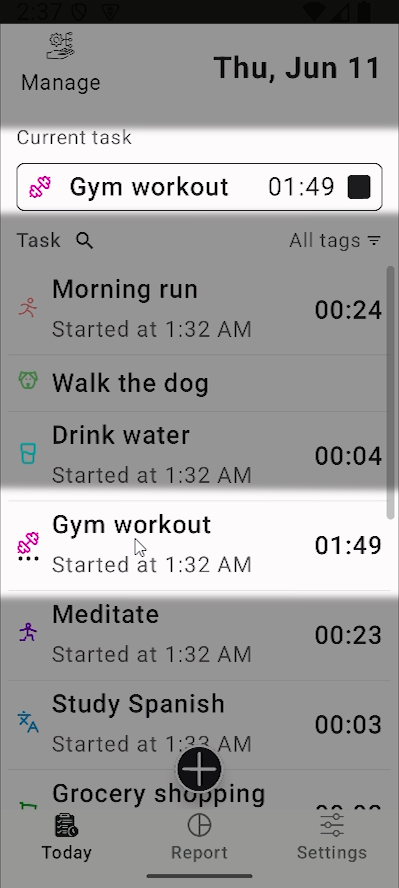
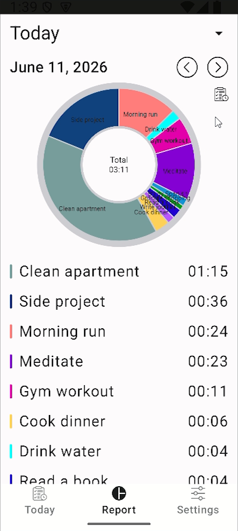
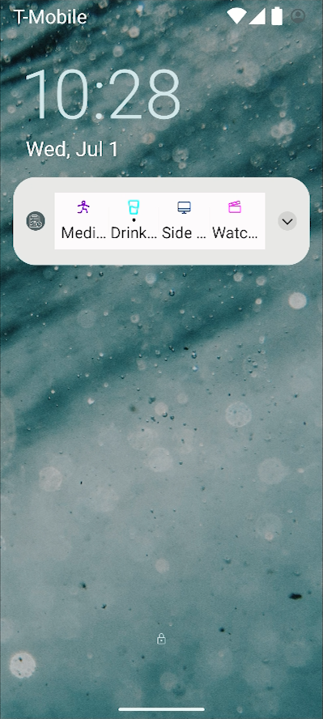

# ActiTracker

[English](README.md) | [Deutsch](README.de.md) | [Español](README.es.md) | [Русский](README.ru.md) | [Українська]

  <b>Простий і зручний трекер часу, що дозволяє візуально оцінити вашу щоденну активність.</b>

  
  
  

<video autoplay loop muted playsinline src="https://github.com/user-attachments/assets/b673c07b-6e17-4f22-be6f-b8fe5aa479c4">
</video>

### 📺 Повне демо-відео

---

## 🎯 Про проект
**actitracker** — це безкоштовна альтернатива подібним додаткам, які вже доступні на маркетах. Такі додатки створені для тих, хто хоче відстежувати, чим він займається протягом дня, і для кого важливо знайти структуру свого дня, а, можливо, і всього життя. Якщо цей додаток допоможе вам у цьому, я буду дуже радий!

## 🚀 Швидкий старт
1. Створіть активності
2. Згрупуйте їх за тегами
3. Додайте деякі активності до панелі сповіщень для доступу з будь-якого місця, включаючи екран блокування
4. Вмикайте та вимикайте таймери активностей
5. Наприкінці дня, тижня, місяця або року проаналізуйте час, витрачений на активності та їх категорії, на спеціальній круговій діаграмі

## ✨ Ключові особливості
- Відстеження часу за активностями
- Групування через теги
- Звіти за днями / тижнями / місяцями
- Швидкий доступ через панель сповіщень
- Налаштування зовнішнього вигляду

## 📚 Документація
Детальна інструкція з використання додатка:  
[Відкрити посібник користувача](docs/uk/USER_GUIDE.md)

### 📦 7. Встановлення
1. Завантажте APK-файл:
[Завантажити APK](https://github.com/tinglevik/actitracker_Android/releases/latest/app-release.apk)
2. Відкрийте файл на вашому пристрої
3. При необхідності дозвольте встановлення з невідомих джерел
4. Підтвердьте встановлення
---

## 🛠 Технологічний стек
*   **Мова:** Kotlin
*   **UI Framework:** Jetpack Compose
*   **База даних:** Room
*   **Архітектура:** MVVM / Clean Architecture
*   **DI:** Koin
