# actitracker — Руководство пользователя

[English](../USER_GUIDE.md) | [Русский](USER_GUIDE.md) | [Deutsch](../de/USER_GUIDE.md) | [Español](../es/USER_GUIDE.md) | [Українська](../uk/USER_GUIDE.md)

## Содержание
1. [Создание списка активностей](#-1-создание-списка-активностей)
2. [Создание тегов (категорий)](#-2-создание-тегов-категорий)
3. [Просмотр визуальных отчетов](#-3-просмотр-визуальных-отчетов)
4. [Настройка быстрого доступа](#-4-настройка-быстрого-доступа-панель-быстрых-действий)
5. [Настройки приложения](#-5-настройки-приложения)
6. [Цели и прогресс](#-6-цели-и-прогресс)

### 🚀 1. Создание списка активностей
Чтобы создать активность, нажмите кнопку «+»

| внизу экрана «Сегодня» | или | вверху справа на экране «Управление» |
| :---: | :---: | :---: |
|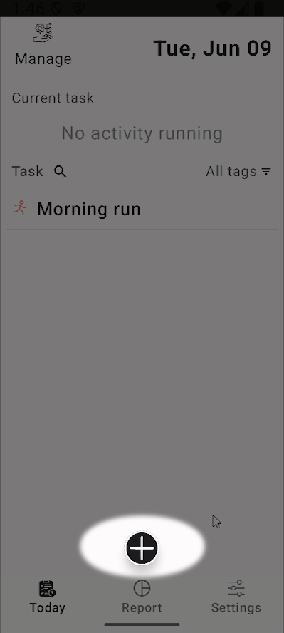 | | 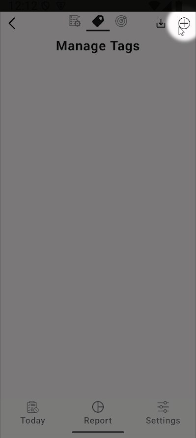 |

В появившемся окне 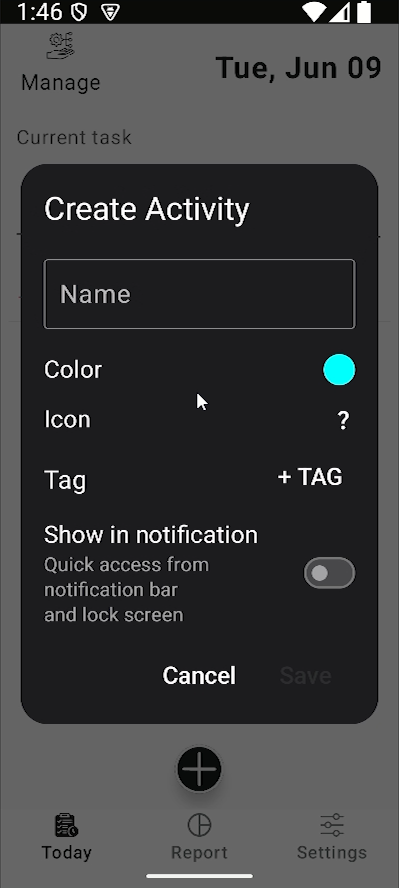 вы можете настроить:

| цвет активности | иконку для неё | назначить ей тег (см. пункт 2) |
|:---: | :---: | :---: |
|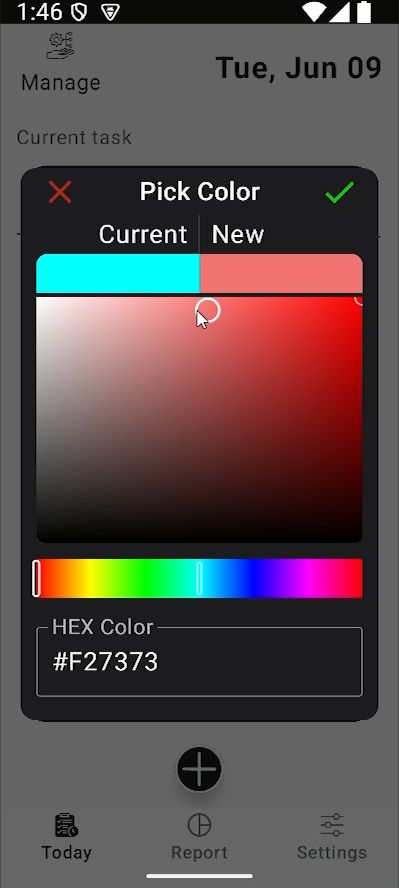 | 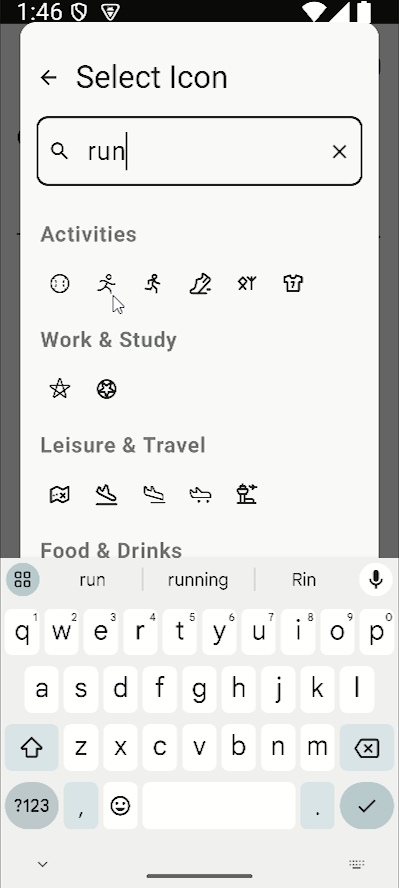 | 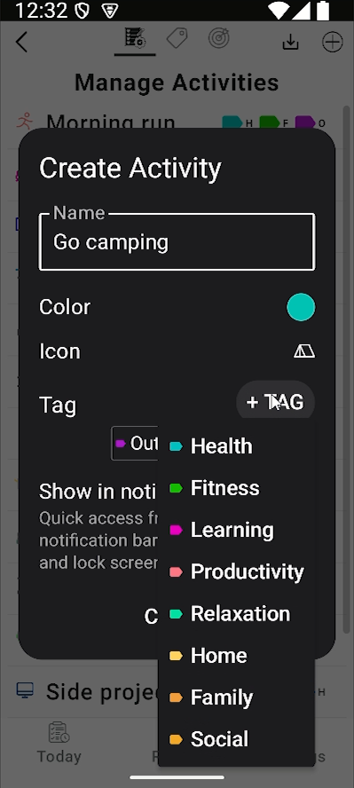 |

После этого вы можете запускать и останавливать активности нажатием по ним на экране «Сегодня», а также из панели уведомлений как на разблокированном, так и на заблокированном устройстве (см. пункт 4 о настройке быстрого доступа). Активности будут выглядеть так:

| Неактивная | Активное отслеживание |
|:---: | :---: |
|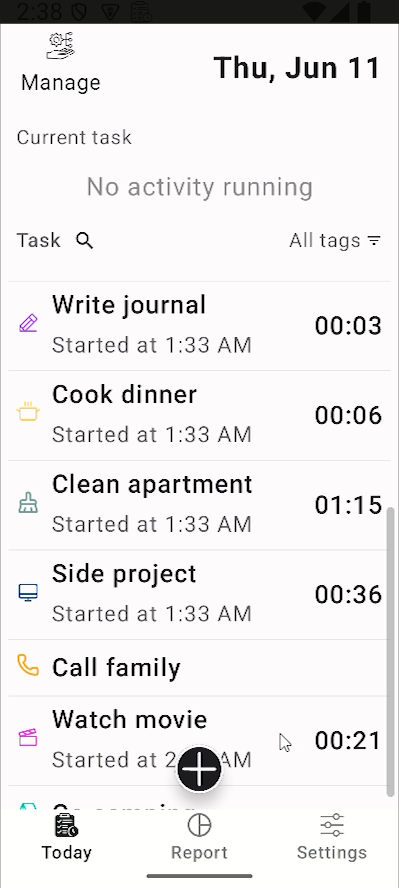 |  |

На изображении справа видно, что на экране «Сегодня» текущая активность также отображается в специальной строке, где её тоже можно остановить.

### 🏷️ 2. Создание тегов (категорий)
Активности можно группировать по категориям с помощью тегов. Чтобы создать и настроить теги, перейдите с экрана «Сегодня» в раздел «Управление», нажав соответствующую иконку в левом верхнем углу экрана 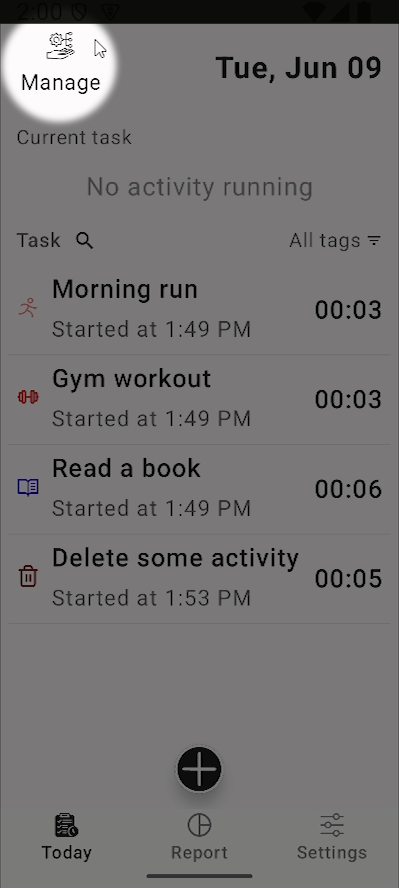, а затем на экране «Управление» перейдите на вкладку «Теги»:

| Список тегов | Настройки тега |
|:---: | :---: |
| 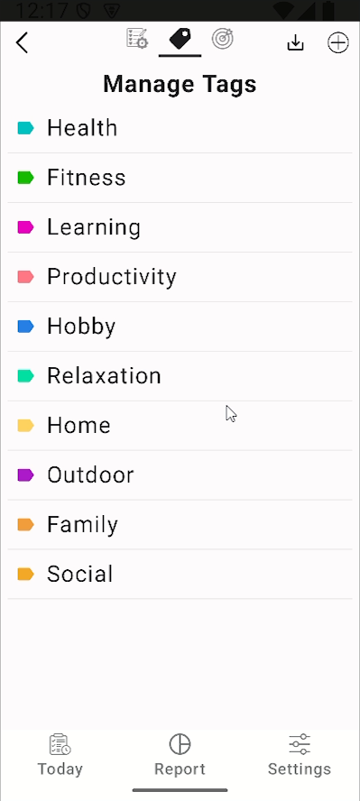 |  |

Кнопка «+» вверху справа на этой вкладке отвечает за создание тега (аналогично созданию активности). Нажмите на тег в списке (левое изображение), чтобы настроить его (правое изображение).

### 📊 3. Просмотр визуальных отчетов
Перейдите на экран «Отчет», нажав иконку на нижней панели. Круговая диаграмма покажет общую картину ваших активностей за день, неделю, месяц или год. Вы можете анализировать продуктивность по активностям или по тегам, переключая режим диаграммы иконкой в её правом верхнем углу. Стрелки над этой иконкой переключают период, за который формируется отчет.

| Отчет по активностям | Отчет по тегам |
|:---: | :---: |
|  | 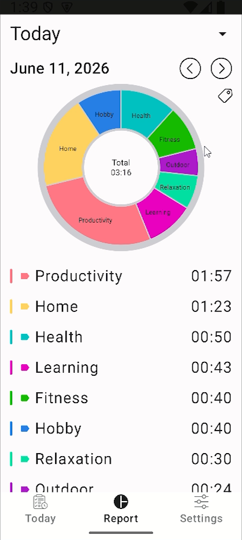 |

### ⚡ 4. Настройка быстрого доступа (Панель быстрых действий)
Вы можете управлять трекингом прямо из панели уведомлений. Для этого добавьте активности на панель быстрого доступа — это позволит запускать и останавливать отслеживание, не открывая приложение и не разблокируя устройство. Сделать это можно долгим нажатием на активность на экране «Сегодня» или с помощью переключателя в окне настроек активности на экране «Управление» (см. пункт 1):

| долгий тап на экране «Сегодня» | из окна «Управление» |
|:---: | :---: |
|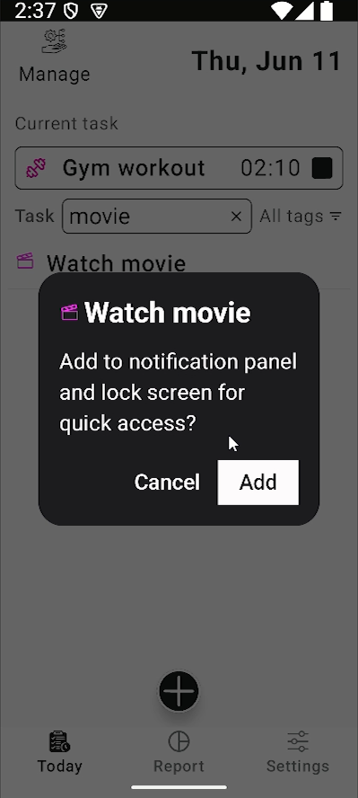 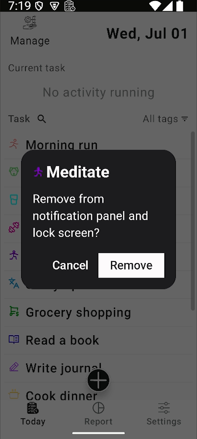 | 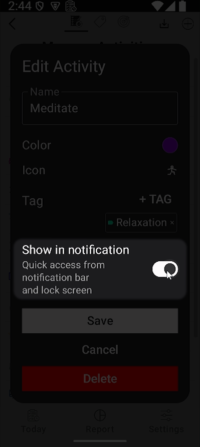 |

Активности в шторке уведомлений будут выглядеть так:

| в шторке уведомлений | на экране блокировки |
|:---: | :---: |
|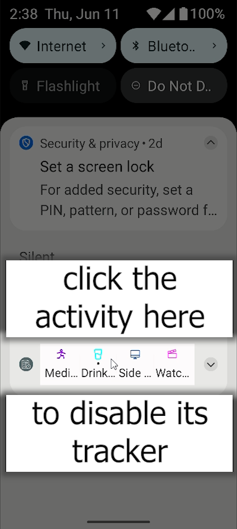 |  |

### 🎨 5. Настройки приложения
Вы можете изменять цвета интерфейса, текста и иконок по своему усмотрению.

| Общие настройки | Настройка цветов |
|:---: | :---: |
|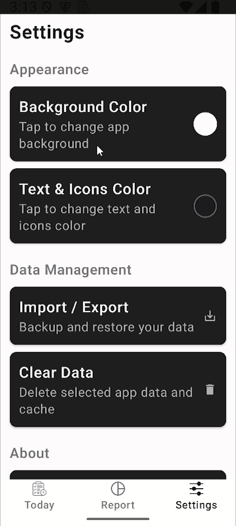 | 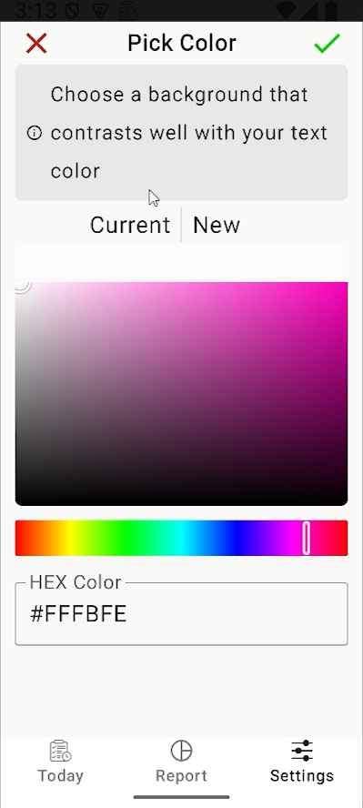 |

> **Примечание.** 
Если вы случайно выберете сочетание цветов фона и текста, которое делает элементы нечитаемыми, приложение автоматически сбросит изменения через 30 секунд, если вы явно не подтвердите сохранение параметров в появившемся справа предупреждении:

| Предупреждение свернуто | Предупреждение развернуто |
|:---: | :---: |
|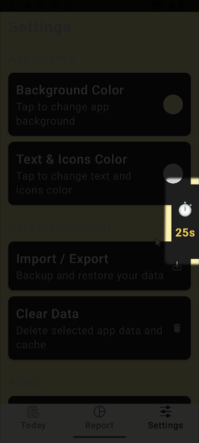 | 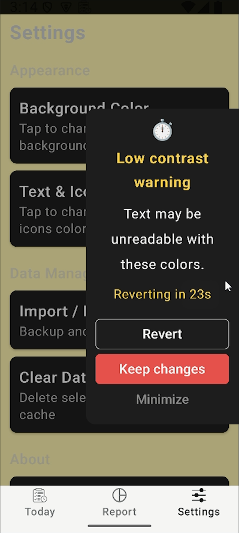 |

### 🏆 6. Цели и прогресс
Эта функция появится в будущих обновлениях. Следите за новостями!

---
[← Назад к README](../../README.ru.md)